# The Photoelectric Effect 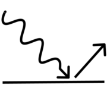
---

Two critical experimental observations led to the development of Quantum Mechanics: the blackbody spectrum and the photoelectric effect. 
In this lab you will explore the photoelectric effect and use it to measure Planck's constant.

Background
---------------------

Quantum Mechanics was developed in the early 1900's, but the evidence for it began to appear even in the late 1800's. 
For example, Heinrich Hertz noticed that sparks started more rapidly when electrodes were illuminated with ultraviolet (UV) light. 
Other investigators later determined that free charges (*i.e.*, electrons) were emitted from metal electrodes illuminated by UV light. 
These were called "photoelectrons". 
Some metals, mostly the alkali metals in the first column of the periodic table, produced a steady supply of photoelectrons (called a "photocurrent") when illuminated by either UV light or visible light, but other metals only did so for UV light. 
Detailed measurements of this "photoelectric effect" established the following characteristics:

1.  For a given metal, there exists a definite cut-off frequency, $\nu_0$. 
    Incident light with frequency below $\nu_0$ produces no photocurrent regardless of its intensity.

2.  For light with frequency $\nu>\nu_0$,
    the magnitude of the photocurrent produced is directly proportional to the intensity of the incident light.

3.  The maximum kinetic energy of the photoelectrons does not depend on the intensity of the light, but it is 
    proportional to the frequency of the incident light.

These characteristics could not be explained by the classical description of light as a wave that continuously transmits energy in proportion to the intensity of the light. 
Explaining these observations required a different description for light, which was proposed in papers by Max Planck (1901) and Albert Einstein (1905).[^1]

They proposed to describe light as consisting of discrete bundles of energy, rather than as a continuous stream of energy. 
The bundles, or "quanta", of energy were named *photons*. 
Each photon carries an energy of $E=h\nu$, where $h$ is Planck's constant with units of energy times time. 
The name of this constant honors Planck because he was the first to use the idea of quanta to explain the blackbody radiation spectrum. Einstein then used it to explain the photoelectric effect as follows.

A photon of incident light transfers all of its energy to an electron in the metal. 
If that energy is sufficient, it can dislodge the electron from the metal, 
*i.e.*, it does some amount of work, $W$, to overcome the potential energy binding the electron in the metal. 
Any excess energy goes into the kinetic energy of the ejected electron,
$$
E= W +\frac{1}{2} m v^2 
$$
Using the photon energy, $E=h\nu$, we get
$$
\frac{1}{2} m v^2 =h\nu -W
$$

Not every electron in the material experiences the same potential, so the work required to eject them varies and their resulting kinetic energy varies. 
However, there is a minimum amount of work required for the most loosely bound electrons, which corresponds to a maximum kinetic energy for the ejected electrons. 
We can measure that maximum kinetic energy by applying a "stopping voltage" which the photoelectrons must overcome to be detected. 
If we call $V$ the voltage required to stop the most energetic electrons (and all the other electrons as well, of course), then $eV_s = \frac{1}{2}mv_{\rm max}^2$. Putting this all together we get the expression
$$
V_s =h\nu/e -\phi
$$
where $\phi$ is called the "work function" of the metal and corresponds to the minumum work required to eject an electron from that particular type of metal. 
Since we divided through by $e$, the work function $\phi$ has units of volts.

This equation is a straight line on a graph of $V_s(\nu)$, with a slope of $h/e$ and a $y$-intercept of $\phi$. 
By measuring $V_s$ for different frequencies of light and fitting such a line we can determine both Planck's constant and the metal's work function.

Instruments
---------------------
The apparatus used in this lab consists of
* **a mercury (Hg) discharge lamp** - which provides the light that will eject electrons from the metal.  

::: Figure:Figure
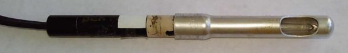
:::

Mercury is an ideal light source for this purpose because it emits a lot of light, but only in a small number of wavelengths.  Figure 2 is a plot of Mercury's emitted light intensity as a function of wavelength.  This kind of plot is called an *emission spectrum*.

::: Figure:Figure
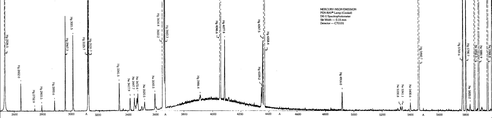
The horizontal axis is wavelength in Ångströms ( $1$Å $=10^{-10}$m),  the vertical dashed lines are the edges of peaks whose intensities are too large to plot on the vertical scale used, and the numbers labelling each peak indicate that peak's central wavelength, again in Ångströms.
:::
* **a wheel of interference filters** - each of which transmits light only in a narrow range of wavelengths, $\lambda = c/\nu$,  and blocks light of all other wavelengths.  Using different filters allows you to change the energy, $h\nu$, of the light that falls on the photocathode.

:::Figure:Figure
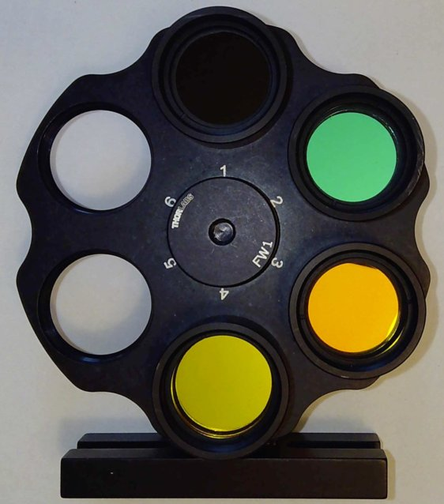

 You can view these individual filters' transmission spectra on the web-portal for this experiment. 
:::
 

* **a phototube** - which holds two metal electrodes under vacuum.[^2]  One of the electrodes is a large, curved rectangle.  The other is a thin cylinder.  The curved rectangle is called the “photocathode” — *cathode* because it attracts cations (or positive charges) and repels (or, in this case, ejects) anions (in this case, electrons) –– and *photo* because it will only do so so when light hits it.[^3]  The photocathode’s curved shape helps concentrate the ejected electrons along the axis of curvature, which is where the thin cylinder is positioned.  The cylinder is called the anode because it is the electrode that attracts anions (*i.e.*, collects the ejected electrons). 

:::Figure:Figure
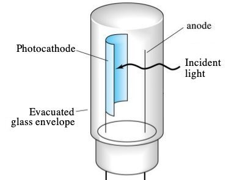

You can't see the phototube on the live feed for this experiment because it is mounted in a  box that has only a small hole to let in the light from the Hg lamp and is otherwise light-tight.

:::

:::Figure:Figure
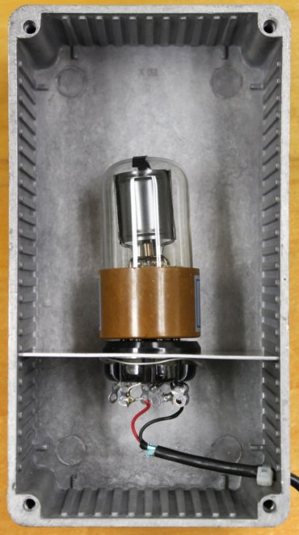
:::

*  **a variable voltage circuit** - which puts an adjustable voltage across the phototube using a pair of AA batteries, connected in series, and variable resistor (also known as a *potentiometer*).

:::Figure:Figure

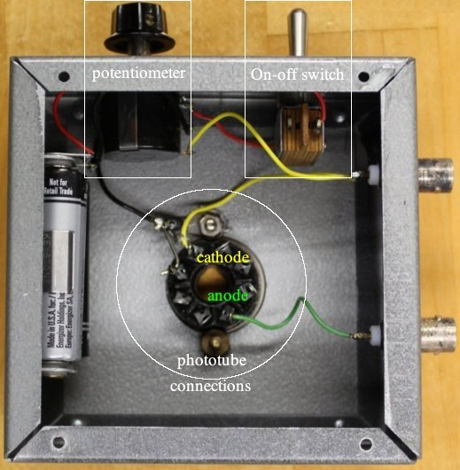

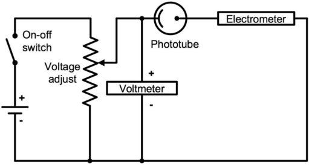

 The circuit is designed to hold the anode at a more negative potential than the photocathode.  
:::
    
* **a digital multimeter (DMM)** - which measures the potential difference between the photocathode and the anode.

:::Figure:Figure

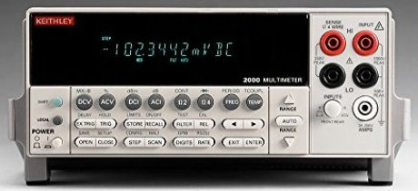 
:::

* and, last but not least, **a sensitive electrometer** - which measures the photocurrent and can reliably detect mere fractions of a picoampere (1 pA = $10^{-12}$A).

:::Figure:Figure

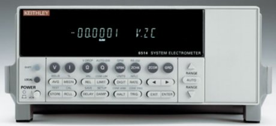

Manuals for these meters are available in PDF format on the web-portal for this experiment. 
:::

Approach
---------------------
Using the instruments above, you will filter the light emitted by a Hg lamp to get photons of very well defined energy and, for a given energy of photons incident on the photocathode, measure the potential difference between the anode and the cathode that stops all photocurrent from reaching the anode (as explained towards the end of the Background section).  

The web-portal for this experiment enables you to press and turn all the same buttons and knobs as you would in person, and observe the effects of your actions through a live video feed. The video feed is displayed at the center of the portal and controls for the knobs and buttons are distributed around it, along with links to helpful information.

:::Figure:Figure

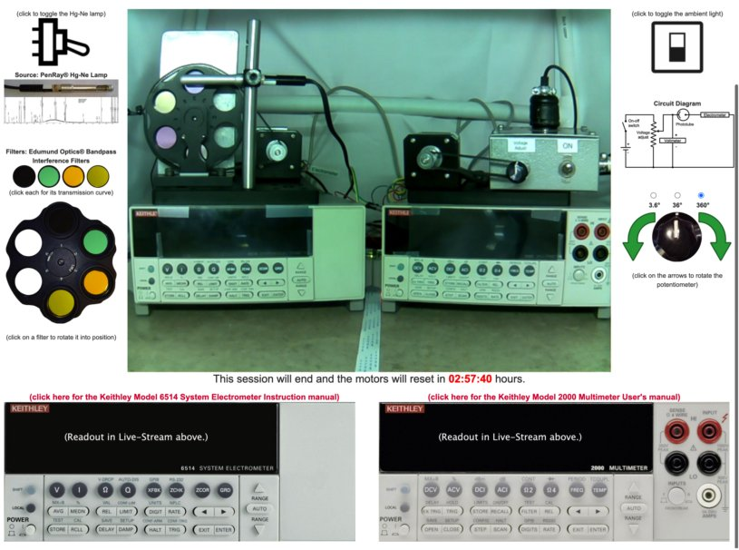

Note the timer immediately below the video feed (in red).  When it runs out, the lab equipment will reset to its initial configuration.
:::

:::Exercise
### Center Video

When you first open the portal the video feed will be dark.  

* Click on the central square of the switch in the upper right to turn on the background/ambient light. 

The ambient light lets you observe the setup and better see the machinery respond to your clicks. You will want to check that it doesn't interfere with your measurements (or just switch it off while collecting data).

### Left Controls

A toggle switch in the upper left controls the power to the Hg lamp. 
* Click the image of the lamp immediately below the toggle switch to access the lamp's user manual.  
* Click the plot below that to view a high-resolution image of the lamp's emission spectrum. 
* Click the photo of a filter to view the transmission spectrum provided by its manufacturer.

::: Question
Using the emission spectrum of the lamp and the transmission spectra of the filters, determine the dominant wavelength(s) of the photons that each filter lets through.
:::

* Click the corresponding filter in the filter wheel and watch the wheel rotate to put that particular filter in between the Hg lamp and the phototube.

### Right Controls

A pair of green arrows to the right of the video feed allows you to turn the potentiometer knob clockwise or counter-clockwise.  The amount of rotation corresponding to a single click is determined by selecting one of the three radio buttons above the arrows.

::: Question
How many full rotations are required to sweep through the entire range of the potentiometer?
:::

### Bottom Controls

Along the bottom of the web-portal are images of the front panels of the electrometer (on the left) and the multimeter (on the right). 
Each image is actually a fully functioning interface to the corresponding device!  
Clicking on a button in the image will cause the device to respond exactly as if you had pressed the that button in person.

* The first thing you should do when you start to work with the apparatus is turn on the meters so that they have time to warm up. 

Most equipment has a "warm up" period, which is simply the time it takes for all the heat production and dissipation mechanisms to come to equilibrium so that the device's components remain at a constant temperature.  Variations in temperature can alter operational details of electronics, such as amplifier gains and leakage currents. The electrometer in particular has calibration circuitry that measures and corrects for most of these temperature dependent effects, but operating at a stable temperature still improves its precision. 

The Keithley 6514 electrometer is central to your measurement, so you may be curious to understand its operation. 
* Click on the red-lettered link above electrometer control panel and skim the user manual's table of contents.

You will notice that the  electrometer can be used to measure voltage, current, resistance or charge. When powered on, it defaults to voltage measurement mode.  For this lab, current measurement is the only relevant capability. 

* Switch to current mode using the front panel button.

The electrometer has ten ranges for current measurement, with the full scale
values ranging from 20 pA to 20 mA. 
:::Question
When the range is set to 20 pA full-scale, how many digits after the decimal point are displayed? 

How many electrons per second does a single unit in that smallest decimal place represent?  

(Recall that 1 Ampere = 1 Coulomb per second and 1 Coulomb $= 6.2\times10^{18}$ elementary charges)
:::

* Select an appropriate range for your measurements using the up and down arrows. 
* Set the RATE setting to SLOW 
* Set the DIGIT setting to display 2 or 3 digits after the decimal point. 

Displaying more digits provides greater precision, but temporal variations typically limit the usable level of precision.
:::

::: Exercise
The Keithley 6514 electrometer is capable of measuring very small currents with great precision, but that precision requires some careful procedures. In particular, it is helpful to calibrate and correct for any offset currents. This can be done with the Zero Check and Zero Correct functions. 

When Zero Check is enabled, the input signal is shorted so that the input amplifier sees only offset currents and voltages that are not part of the input signal and thus should be subtracted. That subtraction can, and should, be done internally using the Zero Correct function, following the procedure below. 

### Zero Correction procedure to remove offsets

1.  If you haven't already, select the current measuring mode by pressing I. 

2.  Select an appropriate measurement range.

3.  Press ZCHK to enable Zero Check mode. You should see a "ZC" message
    appear to the right of the units on the display.

4.  Press ZCOR to subtract the reading in Zero Check mode from future readings. You should see a "ZZ" message appear in the display.

5.  Finally, press ZCHK a second time to disable the Zero Check mode.
    You should see a "CZ" message appear in the display to indicate that the  readings are being corrected for any zero point offsets.

6.  If you ever want to abandon the Zero Correct mode, for example, if you want to check with it is dramatically affecting your measurement, just press ZCOR a second time.

It is *reasonable* to perform the zero correction procedure between each set of measurements ( *e.g.*, for each new filter) to compensate for any drifts that may occur over time.

It is * **essential** * to repeat the zero correction procedure before making a measurement on a more sensitive scale than the last. The offset currents in the machine depend on the measurement scale.  If you correct the offsets at a less sensitive scale and then move to a more sensitive scale without repeating the zero correction procedure, the readings on the more sensitive scale will likley be incorrect because too large of an offest is being subtracted.
:::

Measurement
-----------

There are four optical filters which only pass light in a narrow range of frequency. 
By placing these different filters between the Hg lamp and the phototube (see Exercise 1, Left Controls), you can measure the phototube's response as a function of the light's frequency, $\nu$. 

:::Exercise

With a filter in place, adjust the impeding voltage, $V$, until the photocurrent, $I$, reaches zero; 
the impeding voltage that stops all the current is the stopping voltage $V_s$. 
To make a more precise measurement of $V_s$, you could measure $I$ as a function of $V$ and fit the data to obtain $V_s$. 
* Take a quick, coarse scan to get an idea of the overall shape of $I(V)$. 

:::Question
Which filter did you choose?  
:::

:::Question
What is the overall shape of I(V)? 

Answer in words only.  Use adjectives like {positive, negative, increasing, decreasing, linear, non-linear},  verbs like {approaches, crosses, saturates} and adverbs like {near, far, above, below, at}.
:::

* Decide on a set of voltages that seem appropriate for the filter you chose and record a table of $I(V)$ measurements.

:::Question
What is $V_s$ for the filter you chose?
:::
:::

:::Exercise
* Repeat Exercise 3, answering all of the questions therein, for each of the remaining three filters.  
* Make sure to use the same method for determining $V_s$ for every filter.
:::Question
How did you determine $V_s$?
:::
:::

:::Exercise
* Plot $V_s(\nu)$. $\Rightarrow$**Make this the well-formatted plot you submit for grading. **$\Leftarrow$
* Fit your data to the equation 
$$
V_s =h\nu/e -\phi
$$
to obtain Planck's constant, $h$, and the work function, $\phi$, of the CsSb alloy. 
:::Question
What value did you use for $e$?
:::
The currently accepted value of Planck's constant is $h=(6.62606957 \pm 0.00000029)\times 10^{-34}~\mathrm{J s}$. [^3]
:::Question
How large a fraction of the accepted value is the discrepancy between your measurement of Planck's constant and the accepted value?

Calculate this *proportionate discrepancy* by taking the difference and dividing it by the accepted value:
$$
\frac{|h_\mathrm{measured}-h_\mathrm{accepted}|}{h_\mathrm{accepted}}\,.
$$
Give your answer as a percentage.
:::
:::

(Click )
[^1]: The quantum explanation for the photoelectric effect is described concisely in a three page section of Einstein's paper, Ann. Physik 17, 132 (1905), and was the reason for his subsequently being awarded the Nobel Prize.

[^2]: Removing gas particles from the space between the electrodes greatly reduces the chances that ejected electrons will collide with anything on their way from the cathode to the anode. The vacuum isn’t perfect, of course, but it is good enough that some of the ejected electrons have a good chance of reaching the anode without losing any energy...which is crucial for measuring the maximum kinetic energy of the ejected electrons.

[^3]: The photocathode's inner surface is coated with a special alloy of Cesium (Cs) and Antimony (Sb) metals that has electrons which are not very tightly bound, and so can be ejected by relatively low-energy (*i.e.*, visible) photons. 